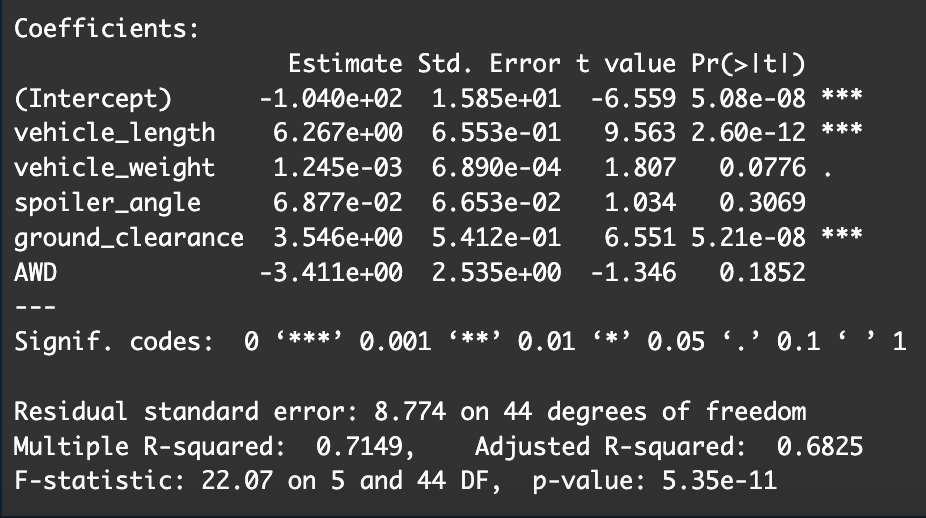
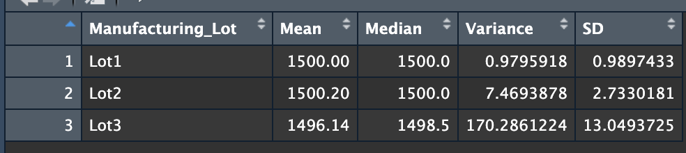
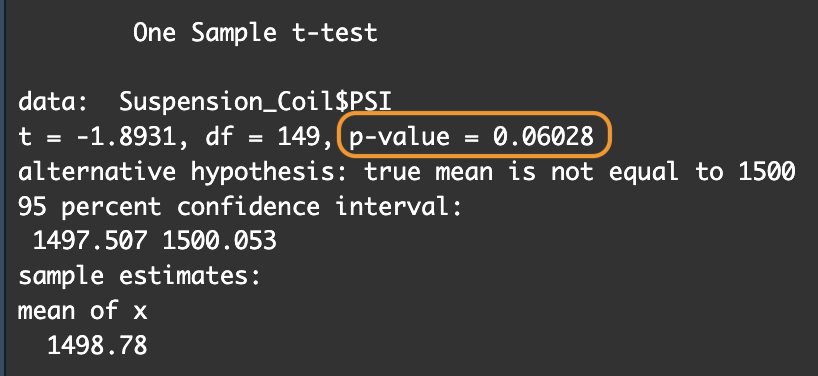
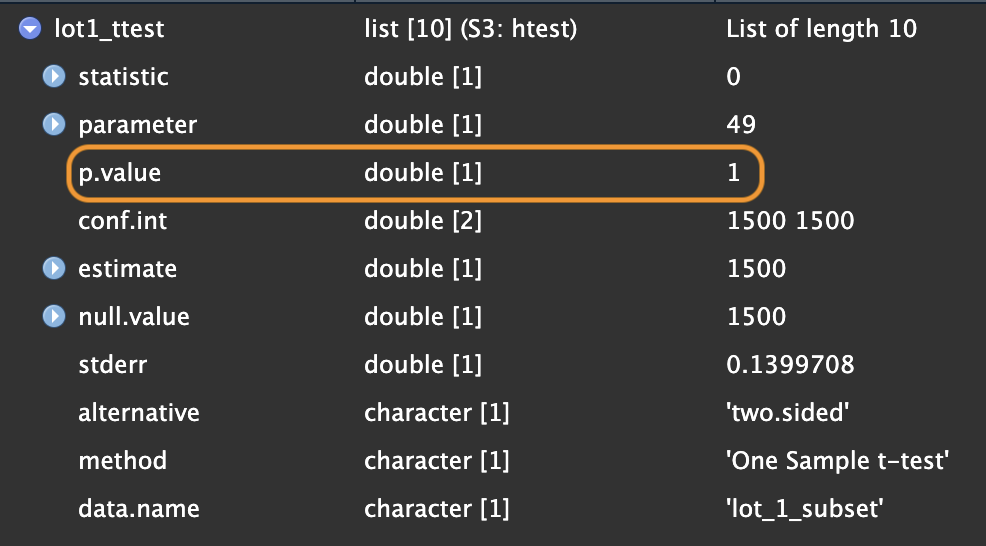
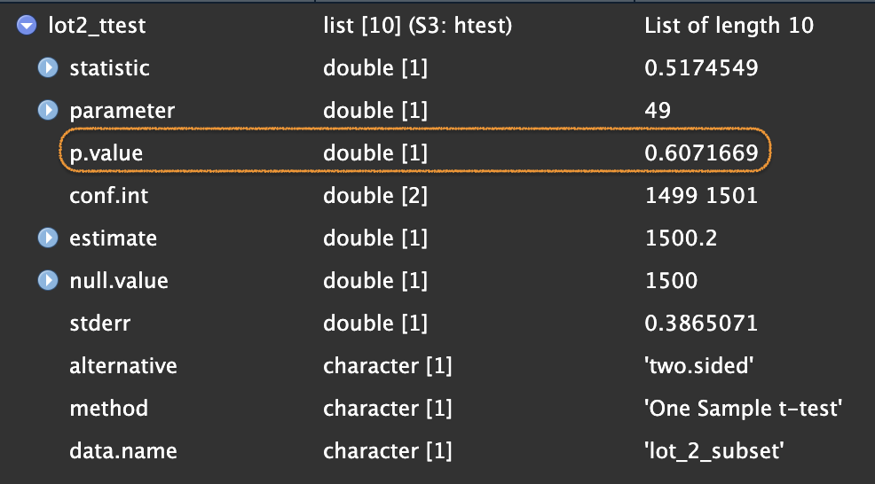
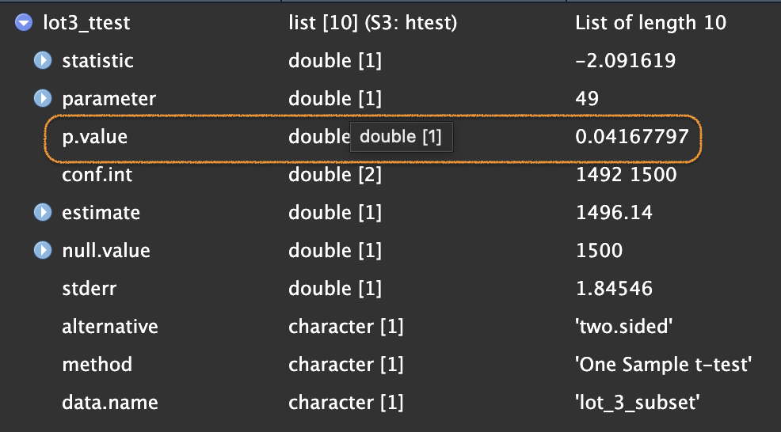

# MechaCar_Statistical_Analysis

## Linear Regression to Predict MPG

The three variables that provided a non-random amount of variance are:

- Vehicle Length
- Ground Clearance

The slope of this linear model would not be considered zero, as the corresponding *p-value* to the summarized F-statistic is very small indeed, which means at least one of these variables (in our case two variables) play a significant role in our 'mpg'.
Furthermore, the 'Adjusted R-squared' value being .68 would also mean that the correlation between these variables and their effect on 'mpg' of the Mecha Cars is fairly good.  
Overall, I would not be able to say that this particular linear model is a good predictor of the Mecha Cars' mpg, because certain predictors are weighing down the correlation. In this dataset, only two of the five predictors made any significant changes. This means that other variables are most likely more of a deciding factor, since Ground Clearance and Vehicle Length are most certainly not the only two reasons a vehicle get good or bad miles per gallon.  
  
---
## Summary Statistics on Suspension Coils

While the total variance does stay below the required 100 pounds per square inch manufacturing specification, Lot 3 definitely does not. Lots 1 & 2 meet the specifications admirably, Lot 3 has a huge amount of variance, as overall, would not meet specifications.  

---
## T-Tests on Suspension Coils

